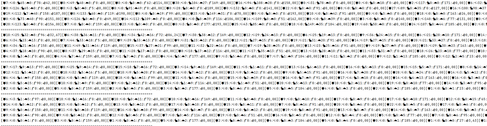

<h1 align="center">Итоговый проект второго модуля JavaRush.</h1>
<h1 align="center">Модель острова.</h1>

#### Владимир Кривко.

#### GitHub: *https://github.com/VladimirKrivko/IslandModel*

#### Менторы: @Andrii Shylin (UA, Kyiv), @Yuriy Syrovatko.

---

## Задача:
&emsp; Запрограммировать модель острова с изменяемыми параметрами, состоящую из массива локаций (например, 100х20 клеток). Локации будут заполнены растительностью и животными. Животные могут:
есть растения и/или других животных (если в их локации есть подходящая еда), передвигаться (в соседние локации), размножаться (при наличии пары в их локации), умирать от голода или быть съеденными.

### Обязательные требования:
- Иерархия животных (ООП) ✅
- Поведение животных ✅
- Многопоточность ✅
- Статистика по состоянию острова на каждом такте (в консоль) ✅

### Дополнительные требования(опционально):

   - Вынести параметры в одно место, чтоб было удобно управлять “симуляцией” ✅
   - ~~Графика вместо консольной статистики. Это может быть как псевдо-графика в консоли, так и JavaFX, Swing…~~
   - ~~Добавь другие факторы, которые могут влиять на симуляцию:~~
     - ~~больше видов животных~~
     - ~~разные виды растений~~
     - ~~кастомное поведение для группы животных (к примеру, волки охотятся и передвигаются не по одному, а стаей)~~
     - ~~рельеф на земле, в том числе река, которая препятствует передвижению некоторых животных~~
---

## Запуск программы:
_*src/main/java/ru/javarush/golf/krivko/islandmodel/MainRun.java*_

---

## Скриншот:

&emsp; На скриншоте в консоль выводятся не все животные, т.к. вывод состояния ячейки с 15-ю видами животных становится неинформативен.

<h3 align="center"> 😵 Спасибо за внимание! 🤘 </h3>

